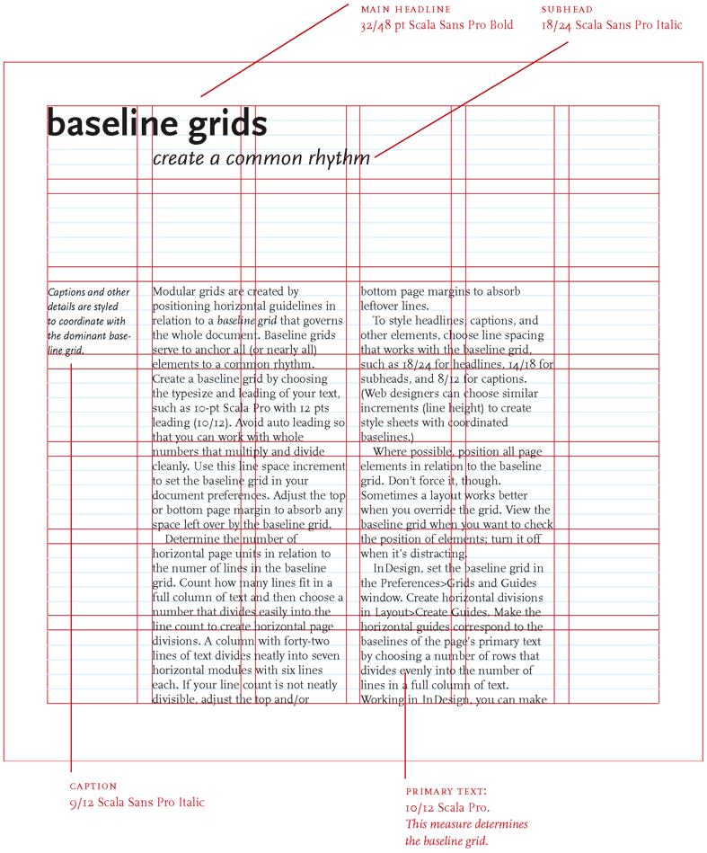

# Grid

####baseline grids

To style headlines, captions, and other elements, choose line spacing that works with the baseline grid, such as 18/24 for headlines, 14/18 for subheads, and 8/12 for captions. 

refer to: http://www.thinkingwithtype.com/contents/grid/

