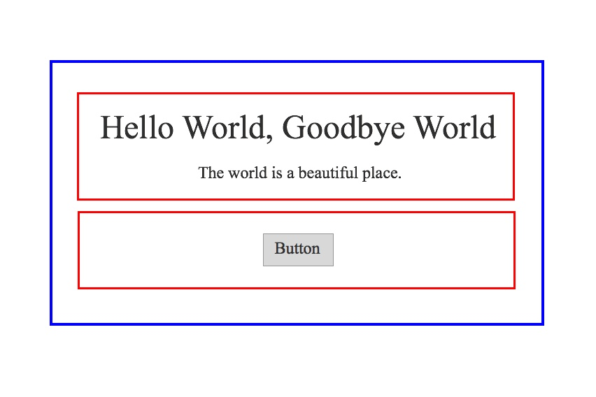

# Sketch

####Basic operation of sketch
http://webdesign.tutsplus.com/tutorials/design-a-material-inspired-mobile-login-form-in-sketch--cms-23042

***Determine the font size based on the container's size.***
48px is three times the font-size height that I have chosen to use (16px) allowing me to center my icons and stay consistent with the content at the same time.

####Keyboard short cut
http://www.jianshu.com/p/bf3e4a9e076e

#### Practical tutorial
http://app.sike.io/courses/design101/first-impression/

##Layout

1. 主标题和副标题构成一个组件；
2. 按钮本身是一个组件；
3. 这两个组件合并为一个更大的组件。

同个 “组件” 里面的东西应该更靠近， 不同类比的组件之间应该有更大距离。这是基本的视觉原则应用。

###background image
背景图的具体宽高
这个背景区域应该设定成多大呢？我们可以让背景图完全充满窗口。虽然这样的视觉冲击最大，但在后面的内容就被隐藏起来了，需要滚动页面才能看到。

另外一个比较通用的做法是让头部背景和窗口一样宽，但限制它的高度。这样就可以保证后面的内容不需要滚动也能显示一部分。参考常见显示器的大小，可以把高度设定在 600~700px 之间。排版示意图大概这样：

***How to mask in Sketch? (裁剪图像)***

